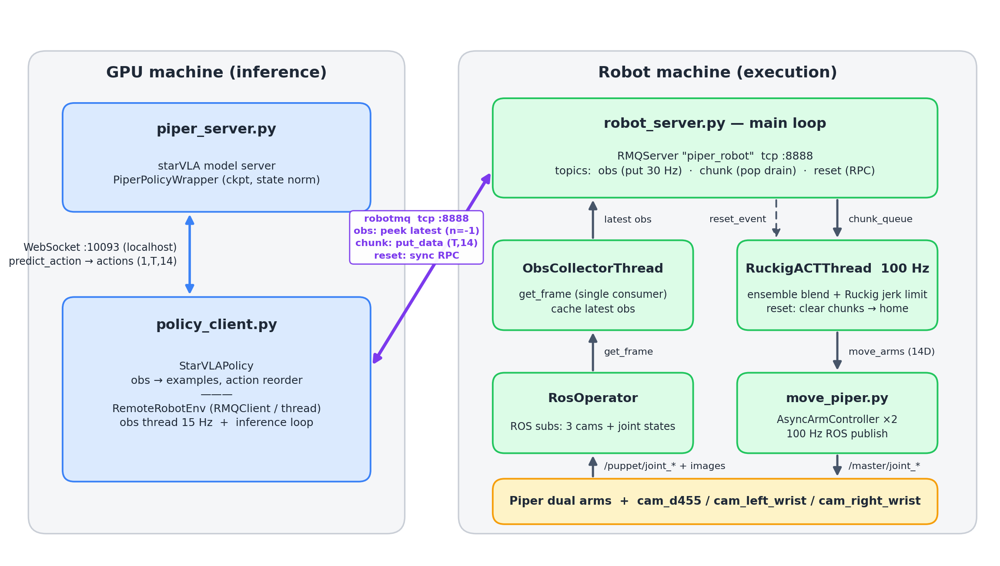

# examples/realRobots/Piper/eval_files —— Piper 双臂真机部署(starVLA 推理后端)

starVLA 的真机部署子模块,由 `smooth/deploy/`(GR00T 真机异步部署)改造而来:
**执行端(Ruckig + temporal ensemble 的 100Hz 平滑伺服)完全不变**,推理后端换成
starVLA 的 WebSocket policy server,跨机传输层用 [robotmq](https://github.com/yihuai-gao/robot-message-queue)
(C++ 后台线程收发、不阻塞 GIL,替代原 ZMQ/pickle)。

## 架构(两台机器、三进程)



- **GPU 机**:`piper_server.py`(模型服务)与 `policy_client.py`(推理客户端)同机,走 localhost WebSocket。
- **跨机**:client 经 robotmq(tcp :8888)连机器人机 —— obs 用 `peek_data(n=-1)` 非破坏取最新、
  chunk 用 `put_data` 单向下发、reset 用 `request_with_data` 同步 RPC(自带超时重发去重)。
- **机器人机**:`robot_server.py` 主循环独占 RMQServer;`ObsCollectorThread` 是 `get_frame` 的
  **唯一消费者**(缓存最新帧);`RuckigACTThread` 100Hz 伺服(ensemble 融合 + Ruckig jerk 限幅)→
  `move_piper.py`(每臂 100Hz ROS 发布线程)→ 真机。

### reset 语义(episode 边界)
client `env.reset()` → robotmq 同步 RPC → 主循环置 `reset_event` → **伺服线程**丢弃残留 chunk、
清 `chunk_history`、把 Ruckig target 设为 home(归位也过 jerk 限幅,单写者)→ 主循环等 obs state
真正到位(<0.05 rad,10s 超时兜底)后,取一张归位后的新帧返回。

> ⚠️ **启动即归零(有意行为)**:`robot_server.py` 一启动,伺服线程就朝零位(home)驱动
> 双臂,不等 client 连接。启动前确保零位路径无碰撞。

## 目录
```
examples/realRobots/Piper/eval_files/
├── config/
│   ├── client_config.yaml   # 推理客户端 + adapter 参数(GPU 机)
│   └── robot_config.yaml    # 执行端 Ruckig / ensemble 参数(机器人机)
├── piper_server.py          # starVLA policy server(send_state 时 server 端用训练 transform 归一化)
├── policy_client.py         # 异步推理客户端 + StarVLAPolicy(GR00T 替身) + RemoteRobotEnv(RMQClient)
├── robot_server.py          # 执行端(RMQServer obs/chunk/reset 三 topic + Ruckig + ensemble)
├── move_piper.py            # 硬件层:AsyncArmController ×2, 100Hz ROS 发布 /master/joint_*
├── RosOperator.py           # ROS I/O(订阅 3 相机 + 双臂关节)
├── smooth/                  # 可切换平滑器(chunk_smoother 块后处理 + target_blender 块边界续接)
└── docs/deploy_arch.png     # 本 README 架构图
```

## 依赖与运行约定
- **两台机器都装 robotmq**(纯 pip wheel,自包含无系统依赖):`pip install "robotmq>=0.1.14"`
- 所有命令从 **starVLA 仓库根目录**运行,并确保 starVLA 根在 `PYTHONPATH`:
```bash
cd <starVLA-root>
export PYTHONPATH=$PWD          # 或: pip install -e .
```

## 启动顺序
1. **[GPU 机] 起 starVLA policy server**:
   ```bash
   python examples/realRobots/Piper/eval_files/piper_server.py --ckpt_path <CKPT>.pt --port 10093 --use_bf16
   ```
   (吃 state 的 ckpt 必须用这个,支持 `normalize_state`;不吃 state 的也可用原始 `server_policy.py`)
2. **[GPU 机] 连通性自测**(强烈建议先做):临时脚本 `from policy_client import StarVLAPolicy` +
   dummy obs 走 `get_action`,断言返回 `(T,14)`、`T==action_chunk_size`。
3. **[机器人机] 起执行端**(⚠️ 启动即归零,见上):
   ```bash
   python examples/realRobots/Piper/eval_files/robot_server.py     # 依赖真机 ROS + CAN
   ```
4. **[GPU 机] 起客户端**:
   ```bash
   python examples/realRobots/Piper/eval_files/policy_client.py    # 默认读同目录 config/client_config.yaml
   ```

## 配置(全部在 config/)
- `client_config.yaml`
  - `starvla.{host,port,unnorm_key,send_state,use_ddim,num_ddim_steps}`
  - `robot_server.{ip,port}`、`obs_freq`、`instruction`(null=用 obs 自带)
  - `adapter.{cam_order,image_size,bgr_to_rgb,reorder}`
- `robot_config.yaml`:`dof/control_freq/target_update_freq/max_velocity/max_acceleration/max_jerk/
  ensemble_history_len/chunk_smoother/target_blender`…(Ruckig + ensemble)

## ⚠️ 接真机/换 checkpoint 前必须核对
1. **相机顺序/色序**(最易错→动作全乱):`adapter.cam_order` 必须 == 训练 `video_keys` 顺序;若
   `RosOperator.get_frame()` 输出 BGR(训练用 RGB),把 `adapter.bgr_to_rgb` 设 `true`。
2. **动作重排** `adapter.reorder`:默认按 Robotwin/Agilex 的 `[L_arm,R_arm,L_grip,R_grip] →
   [L_arm,L_grip,R_arm,R_grip]`;换 ckpt 要按其 `action_keys` 顺序复核(自训时若直接按执行端顺序
   定义,可设恒等 `reorder`)。
3. **unnorm_key**:多 robot checkpoint 必须在 `client_config.yaml` 填(单 robot 留 `null` 自动选);
   可先用连通性脚本看 `available_unnorm_keys`。
4. **state**:不吃 state 的 ckpt → `send_state: false`;吃 state 的 ckpt(如 QwenPI_v3)→
   `send_state: true` + 用 `piper_server.py` 启动:client 传 **raw** state,server 端用训练同款
   transform 自动归一化。
5. **夹爪量纲/极性**:server 输出已是训练空间;若真机 `move_arms` 期望的夹爪范围与训练 action 不一致,
   在 client adapter 做一次映射(保持执行端不动)。
6. **零位安全**:robot_server 启动即向零位驱动;`max_velocity/max_acceleration` 先调低。

## 分阶段验证
1. **连通性**:临时脚本(`from policy_client import StarVLAPolicy` + dummy obs)断言返回 `(T,14)`。
2. **robotmq loopback**(无真机):双进程冒烟 —— fake RMQServer(obs/chunk/reset 三 topic)+ 真
   `RemoteRobotEnv`,验 reset RPC / obs peek-latest(server_time 递增)/ chunk round-trip 与
   numpy shape/dtype 保真。注意 robotmq 的 server/client 必须**独立进程**(同进程线程会死锁)。
3. **无真机 dry-run**:把 `robot_server.py` 的 `move_piper.move_arms` 临时换成打印,起三进程,
   看动作块持续流入、Ruckig 不报错、ensemble `q_target` 连续无跳变。
4. **真机**:先大幅调低 `max_velocity/max_acceleration`、空间无碰撞,确认方向/极性正确、动作平滑,
   再逐步提速。重点再验:episode 2 的 reset 手臂实际归位、reset 返回的 obs 是归位后画面。

## 已知点
- **发整块**:client 一次把整 `(T,14)` 块经 `send_chunk` 下发,对齐 server 端 ensemble 的二维输入
  预期(原 GR00T `build_chunk` 只取第 0 帧会让 ensemble 退化)。
- **时序对齐**:`policy_step` 每轮 +1,server 端按 `target_update_freq`(须 == 训练数据 fps,
  fold=30)推进分数步;starVLA 推理频率与之不符会让 ensemble 错位。
- **gripper 经 Ruckig**:二值夹爪本应突变,被 jerk 限幅会变钝;如有问题,后续让 gripper 维旁路
  Ruckig(届时才动执行端)。
- **obs 新鲜度**:robot 端只在采到新帧时 `put_data`(TTL 1s 自动清陈旧);client `peek_data(n=-1)`
  永远拿最新,天然丢中间帧 —— 与原 obs 缓存语义一致。
